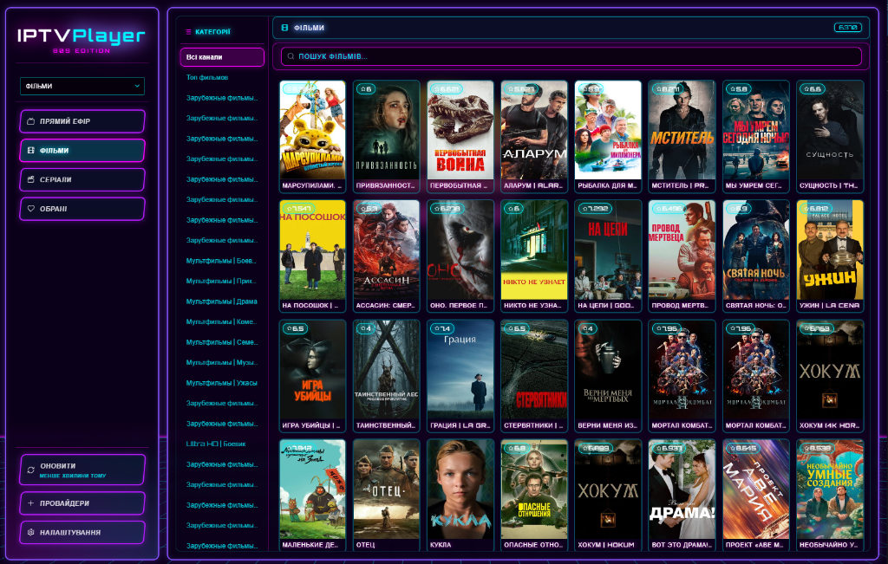

# IPTV Player 80s Edition



## Про програму
Це Альфа-версія сучасного IPTV-плеєра, виконаного в стильному неоновому дизайні (Synthwave / Cyberpunk 80-х). Програма дозволяє зручно переглядати IPTV-канали, фільми та серіали.

**Увага:** На даний момент програма знаходиться на стадії **Альфа-тестування**. Інтерфейс доступний лише українською мовою. У майбутньому планується багато оновлень, додавання нових мов та покращення стабільності!

## Основні функції
- 🕹️ **Неоновий Synthwave інтерфейс** — атмосферний дизайн із динамічними анімаціями, світінням та "скляними" панелями.
- 📺 **Прямий ефір (Live TV)** — підтримка категорій, пошуку та зручного перегляду ТБ.
- 🎬 **Фільми та Серіали (VOD)** — перегляд відео за запитом із постерами, рейтингами та описами.
- 📡 **Підтримка провайдерів** — наразі програма чудово оптимізована та **найкраще працює з провайдерами формату Xtream Codes** (рекомендується).
- ⚙️ **Налаштування** — керування підключеними провайдерами та оновлення плейлистів.

## Встановлення
Ви можете завантажити актуальну версію програми у розділі [Releases](../../releases). 
Просто завантажте `.exe` інсталятор і запустіть його на вашому комп'ютері.

---

### Для розробників (Development Setup)

```bash
# Встановлення залежностей
npm install

# Запуск в режимі розробки
npm run dev

# Збірка для Windows
npm run build:win
```
